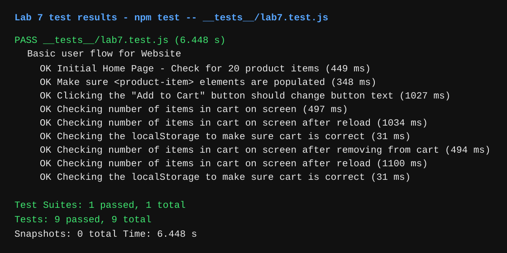

# Lab 7 - Unit & E2E Testing

Name: Fahad Majidi

Partner: N/A

## Check Your Understanding

1. I would fit automated tests within a GitHub Action that runs whenever code is pushed. This keeps the tests tied directly to the development pipeline, catches regressions quickly, and makes sure the same checks run consistently for everyone working on the project.

2. No. An end-to-end test is better for checking a full user flow in the browser. To check whether a function returns the correct output, I would use a unit test.

3. Navigation mode analyzes a page immediately after it loads and gives feedback about that initial page load. Snapshot mode analyzes the current state of the page at the moment the report is run, which is more useful for checking the page after it has already been interacted with, but it does not measure the full loading process.

4. Three improvements we could make to the CSE 110 shop site are:
   - Add mobile viewport metadata and stronger responsive styling so the page works better on different screen sizes.
   - Optimize product images by resizing them, compressing them, and lazy-loading offscreen images to improve performance.
   - Add more SEO and accessibility metadata, such as a page description and a language attribute on the HTML element.

## Test Results

